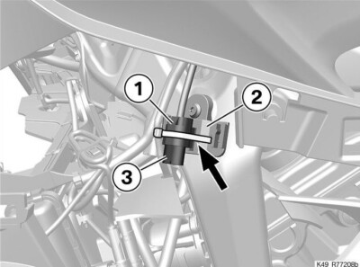
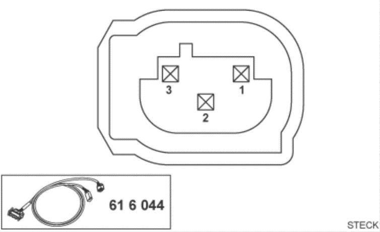
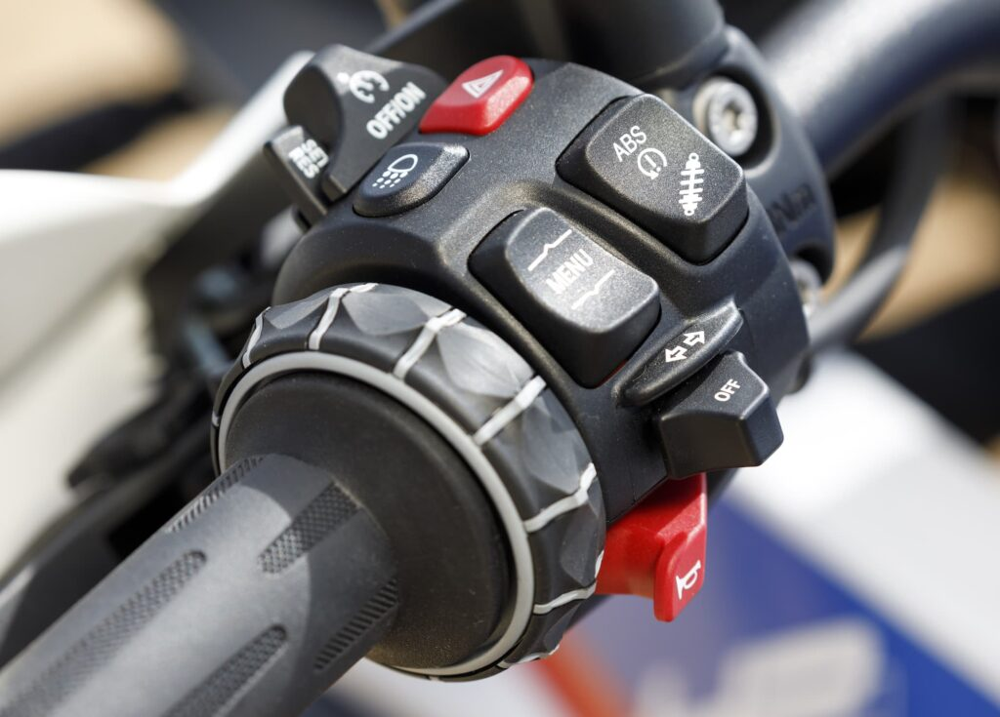
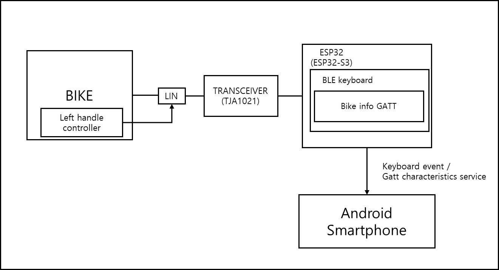

# bmw-motorrad-cluster-linbus
본 프로젝트는 BMW Motorrad 바이크에서 발생하는 LIN 신호를 수집하여, 안드로이드 애플리케이션으로 제작된 클러스터 앱으로 바이크의 신호를 전달하는 기능을 개발하는 프로젝트입니다.
### 프로젝트 목표
1. BMW Motorrad 바이크에서 발생하는 LIN 신호를 수집
2. 수집된 정보를 분석
3. 분석된 정보를 안드로이드 애플리케이션으로 전달
4. 특히, Wonder Wheel와 Left handle controller 에서 발생하는 신호를 키보드 신호로 변환
5. 변환된 신호를 BT로 클러스터용으로 사용되는 스마트폰으로 전달

### 본 기능을 구현하기 위한 준비
1. BMW Motorrad 바이크
    - 호환 바이크(아래 목록은 확인된 모델입니다.)
      - 다음 링크에서 확인 가능합니다.([호환 바이크 목록](https://support.chigee.com/portal/en/kb/articles/bmw-quick-release-module-compatible-with-my-bmw#Check_the_compatibility))
      - 목록에 있는 바이크라도 SA272 옵션이 활성화가 되어 있어야 합니다.
      - 호환 목록에 있는데 SA272 옵션이 활성화 되어 있지 않다면, 바이크 딜러에게 문의하세요(한국의 경우 무료로 활성화 해주는것 같습니다 - 대구모토라드에서 확인)
      - SA272 옵션에 관한 사항은 [여기](https://www.press.bmwgroup.com/global/article/detail/T0359072EN/bmw-motorrad-presents-the-connectedride-cradle?language=en&fbclid=IwY2xjawF-mJ1leHRuA2FlbQIxMAABHXRXplf8AjLW2__5PemRjKPCoMDz_VineueeQhf8kJKMYlkG0sXV8_haww_aem_2-oVlBHhYn440JX6JfUA5g)에서 확인 가능합니다.

2. 클러스터 앱을 설치할 수 있는 안드로이드 스마트폰
    - 다음 링크의 프로젝트에서 공유하고 있는 코드를 빌드해서 설치할 수 있어야합니다.
    - 다음 링크에서 확인 가능합니다.([클러스터 앱 github](https://github.com/kendrickkim/bmw-motorrad-cluster-application))
3. ESP32 개발보드
   - ESP32 / ESP32-S3에서 동작을 확인했습니다.
4. LIN 트랜시버
   - 알리익스프레스 등에서 LIN 트랜시버를 구할 수 있습니다.(TJA1021 칩을 사용한것을 추천합니다.)
5. 안드로이드 오토 리시버 애플리케이션
   - 이 프로젝트에서는 headunit reloaded 애플리케이션을 사용했습니다.

### 본 프로젝트를 직접 수행하기 위한 엔지니어 스킬셋
1. Android application 개발
   - compose 기반 안드로이드 애플리케이션 개발
2. 하드웨어 구성 이해 / 디지털 신호 분석
3. ESP32 개발
   - 본 프로젝트에서는 arduino platform을 사용했습니다.
   - BLE 동작 이해
 
 

# LIN BUS 신호 분석
이 부분에서는 BMW Motorrad 바이크에서 발생하는 LIN 신호에 대한 내용을 기술합니다.
애플리케이션 / ESP32 개발에 관한 부분은 다음 링크를 참조하세요
* [클러스터 애플리케이션 개발](https://github.com/kendrickkim/bmw-motorrad-cluster-application)
* [ESP32 펌웨어 개발](https://github.com/kendrickkim/bmw-motorrad-cluster-esp32)
 
 

#### 본 프로젝트에서는 제가 사용하고 있는 BMW S1000XR(2016식) 기준으로 설명합니다.
 
 

## BMW Motorrad 바이크의 LIN 신호
BMW Motorrad 바이크에서는 바이크에서 발생하는 다양한 정보를 CAN BUS 또는 LIN BUS를 통해 전달합니다. LIN BUS는 CAN BUS와 비교하여 상대적으로 저속 / 저비용으로 전달하는 버스입니다. 따라서, 수집할 수 있는 정보는 상대적으로 적지만, 간단하게 수집할 수 있습니다.
  

S1000XR 의 경우 왼쪽 페어링을 분리하면 위 그림과 같은 소켓을 찾을 수 있습니다.

커넥터 모양은 아래 그림과 같습니다.

|핀번호|핀 기능|설명|
|---|---|---|
|1|GND||
|2|LIN|여기에서 신호가 나옵니다.|
|3|12V|바이크가 on 상태가 되어야 공급되는 전원입니다.|

알리 익스프레스 등에서 해당 소켓은 구할 수 있습니다.

## 바이크에서 발생하는 LIN 신호를 분석하면 도대체 뭐가 좋을까?
* 바이크에서 발생하는 정보(속도 / RPM / 컨트롤)를 스마트폰으로 전송할 수 있습니다.
* 특히 BMW Motorrad 바이크에 장착되어 있는 Wonder Wheel을 이용하면, 스마트폰을 제어할 수 있습니다.
  

* 스마트폰을 네비게이션용으로 사용하고 있다면, Wonder Wheel로 네비게이션을 제어할  수 있습니다.

## 위에서 설명했던 기능과 구조를 그림으로 표현하면 아래와 같습니다.

## 현시점(2025-06-19)까지 분석된 LIN 신호내용입니다.
1. 속도
2. RPM
3. Wonder Wheel
4. Left handle controller
5. 기어 정보
6. 전압

## 추가 분석 필요 신호(더 필요한 신호가 있다면 추가 요청 부탁드립니다.)
1. 엔진 경보
2. 방향 지시등 동작여부
3. 냉각수 온도
4. 총 주행거리
5. 잔여 연료량
6. 등화류 점화 상태
7. 브레이크 압력(앞/뒤)

## 현재까지 개발된 내용의 동작 영상
정리 없이 막 써놨는데, 영상을 보시면 이프로젝트에서 뭘 하려고 하는지 금방 이해 되실겁니다.

[https://www.youtube.com/watch?v=BmVxNDDYLkI](https://www.youtube.com/watch?v=BmVxNDDYLkI)

### 바이크 라이딩을 좋아하시는 엔지니어 여러분들 이 프로젝트에 참여해주세요

